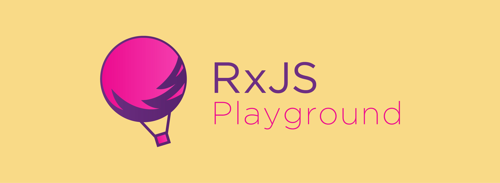

  <!-- <h1>RxJS Playground</h1> -->
  

  
🌟 Clean examples, explanations, and resources for learning and exploring RxJS ✨</h4>

[![PRs Welcome][prs-badge]][prs]
[![Code of Conduct][coc-badge]][coc]
[![MIT License][license-badge]][license]

> Clean examples, explanations, and resources for learning and exploring RxJS in depth 👊

### Current Examples
- [x] Animation Painting
- [x] Canvas Painting
- [x] Crop a Image
- [x] Data Binding
- [x] Debt Calculator
- [x] Drag and Drop
- [x] Dynamic Rendering
- [x] Follow the Mouse
- [x] Github Fetch
- [x] Image Color Selector
- [x] Infinite Scroll
- [x] Letter Count
- [x] Mario
- [x] Mouse Tracking
- [x] Real Time
- [x] Smart Counter
- [x] Typehead
- [x] Netflix Virtual List

### Awesome Resources
* [The introduction to Reactive Programming you've been missing](https://gist.github.com/staltz/868e7e9bc2a7b8c1f754) - Andre Staltz
* [Rx Marbles - Interactive diagrams of Rx Observables](http://rxmarbles.com/) - André Staltz
* [Observables Under The Hood](https://netbasal.com/javascript-observables-under-the-hood-2423f760584) - Netanel Basal
* [Rx Visualizer - Animated playground for Rx Observables](https://rxviz.com) - Misha Moroshko
* [Reactive.how - Animated cards to learn Reactive Programming](http://reactive.how) - Cédric Soulas
* [Zen Observable](https://github.com/zenparsing/zen-observable) - An implementation of Observables for JavaScript

### Contributing
If you find a bug or think about enhancement or adding new examples, feel free to contribute and submit a PR. Contributions of any kind are welcome!

> Special thanks to [Baran Pirinçal](https://github.com/baranpirincal) for an outstanding new logo design 👏 👏

## License
MIT © [Jay Kan](https://github.com/JayKan)
 
MIT @ [Baran Pirinçal](https://github.com/baranpirincal) for the awesome new logo

[prs-badge]: https://img.shields.io/badge/PRs-welcome-brightgreen.svg?style=flat-square
[prs]: https://github.com/JayKan/RxJS-Playground/pulls
[license-badge]: https://img.shields.io/npm/l/express.svg?style=flat-square
[license]: https://github.com/JayKan/RxJS-Playground/blob/master/LICENSE
[coc-badge]: https://img.shields.io/badge/code%20of-conduct-brightgreen.svg?style=flat-square
[coc]: https://github.com/JayKan/RxJS-Playground/blob/master/CODE_OF_CONDUCT.md
